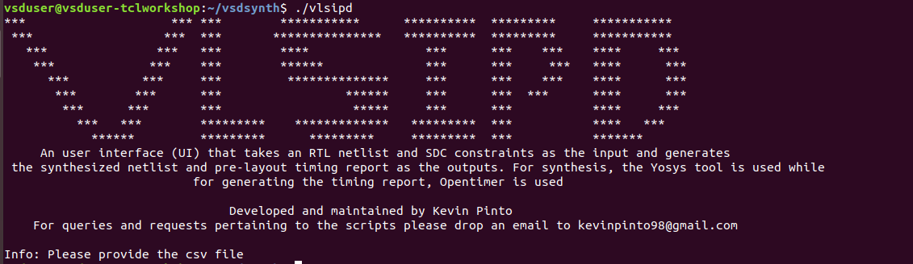

# Tcl Workshop: From introduction to Advanced Scripting Techniques in VLSI Design and Synthesis
This repository documents the tasks performed during the tcl scripting
workshop conducted from 02/05/25 to 11/05/25. Mentioned below are the
various subtasks perfomed for each of the days pertaining to the files
vlsipd and vlsipd.tcl.

## Day1: Introduction and VSDSYNTH Toolbox Usage
On the first day the task was to create a unix command vlsipd that
can take as input the .csv file and pass it onto the tcl script. The
user interface (UI) created on the first day is as follows:

## Day2: Variable Creation and Processing Constraints from CSV
The main task for this day was converting all files to format[1] and SDC format, and then passing it onto the synthesis tool yosys. The various sub-tasks performed to achieve this are:
* Creating the necessary variables
* Checking if the contents (i.e. files and directories) in the input .csv file exist
* Reading the constraints file and converting it into .sdc format
* Reading the netlist files
* Creating the main synthesis script in format[2]
* Passing the script to the Yosys tool

## Day3: Processing Clock and Input Constraints
The various sub-tasks performed during Day 3 were:
* Creating clocks
* Categorizing input ports as either bits or bussed
* Generating constraints for the output (similar to how it was done for inputs)

## Day4: Completing Scripting and Yosys Synthesis Introduction
The various sub-tasks performed during Day 4 were:
* Checking for the hierarchy
* Performing error handling in the hierarchy check
* Creating a log file for the hierarchy check

## Day5: Advanced Scripting Techniques and Quality of Results Generation
The main task for the final day was to converting all format[1] and SDC to format[2]. This will later be passed onto the Opentimer tool for STA analysis. Additionally, on the final day the concept of procs and it's usage was introduced as well. 
 
 To run vlsipd command first copy the vlsipd shell script and the vlsipd.tcl script into the same directory as the openMSP430_design_details.csv file. After that, you can run: 
 `./vlsipd openMSP430_design_details.csv` 

The timing report generated at the end of the course is as shown below:

